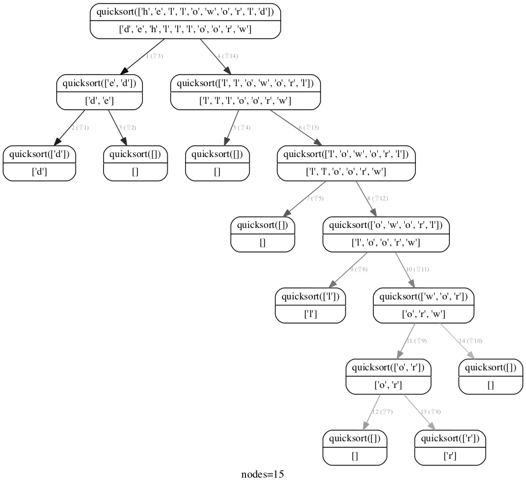
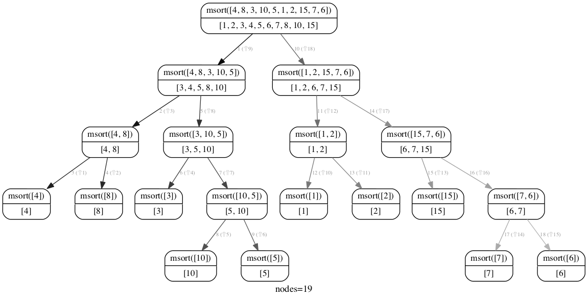
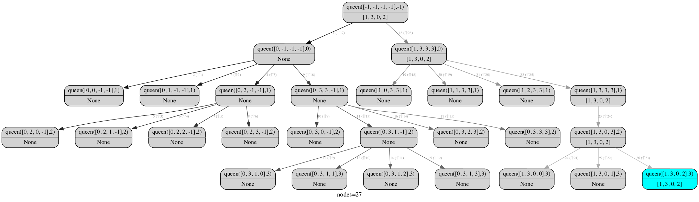

rcviz
=======

* Python module to visualize a recursion as a tree with arguments and return values at each node.
* Provides a decorator to instrument target functions (as opposed to trace or debugger based approaches)
* Uses pygraphviz to render the graph.

## Usage

1. Use the @viz decorator to instrument the recursive function.
> @viz <br>
> def factorial(n):

2. Render the recursion with
> callgraph.render()

The output file is "out.svg". 

## Example: Quick sort

```python
from rcviz import callgraph, viz

@viz
def quicksort(items):
    if len(items) <= 1:
        return items
    else:
        pivot = items[0]
        lesser = quicksort([x for x in items[1:] if x < pivot])
        greater = quicksort([x for x in items[1:] if x >= pivot])
        return lesser + [pivot] + greater

print quicksort( list("helloworld") )
callgraph.render()
```

## Output



Note:
1. The edges are numbered by the order in which they were traversed by the execution.
2. The edges are colored from black to grey to indicate order of traversal : black edges first, grey edges last.


## Example: Merge sort

See msort.py.



## Dependencies

This requires graphviz and pygraphviz to work.

## Annotation

To annotate a recursive call, return a tuple of 2 things: the first item is the normal return value,
and the second is either a color index between 1 and 10 or a string that is a [graphviz color](http://www.graphviz.org/doc/info/colors.html).
If the function doesn't return a value normally, to annotate return a tuple of one element (the color).

See nqueen.py



